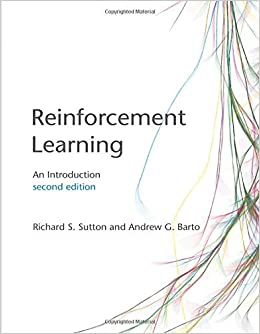

# Reinforcement Learning (RL) Resources

## Lectures

### Free

- Introduction to Reinforcement Learning

  - Instructor: Prof. David Silver (UCL)

  - Date: 2015

  - Playlist: [Youtube](https://www.youtube.com/watch?v=2pWv7GOvuf0&list=PLqYmG7hTraZDM-OYHWgPebj2MfCFzFObQ)

  - Additional

    - [Site](https://deepmind.com/learning-resources/-introduction-reinforcement-learning-david-silver): slides, video available

  - Comments

- Reinforcement Learning Lecture Series 2018

  - Instructor: Hado van hasselt (Google DeepMind)

  - Date: 2018

  - Additional

    - [site](https://deepmind.com/learning-resources/reinforcement-learning-lectures-series-2018): video available

- CS234: Reinforcement Learning

  - Instructor: Prof. Emma Brunskill (Stanford)

  - Playlist: [Youtube](https://www.youtube.com/watch?v=FgzM3zpZ55o&list=PLRQmQC3wIq9yxKVK1qc0r2nPuInn92LmK) (Winter 2019)

  - Additional

    - [site](http://web.stanford.edu/class/cs234/index.html): slides, assignment available

  - Comments

- CS285: Deep Reinforcement Learning

  - Instructor: Prof. Sergey Levine (UC Berkeley)
  
  - Playlist: [Youtube](https://www.youtube.com/playlist?list=PL_iWQOsE6TfURIIhCrlt-wj9ByIVpbfGc) (Fall 2020)

  - Additional

    - [site](http://rail.eecs.berkeley.edu/deeprlcourse/): slides, assignment available

- Reinforcement Learning and Optimal Control

  - Instructor: Prof. Dimitri P. Bertsekas (MIT)

  - Additional:
    - [site](http://www.mit.edu/~dimitrib/RLbook.html): slides, video available

    - has companion book (Reinforcement learning and optimal control)

### Paid

- Reinforcement Learning Specialization

  - Instructor: Martha White & Adam White  (University of Alberta)

  - Additional:

    - [site](https://www.coursera.org/specializations/reinforcement-learning): video and assignment available

    - Consists of three lectures & Capstone project

      - Fundamentals of Reinforcement Learning
      - Sample-based Learning Methods
      - Predictions and Control with Function Approximation
      - A Complete Reinforcement Learning System

    - You can also take the lecture by audit (no assignment)

## Books

- Reinforcement Learning: An Introduction (2nd edition)

  - Author: Andrew Barto and Richard S. Sutton 

  - Available: [paperback](https://www.amazon.com/Reinforcement-Learning-second-Introduction-Computation-ebook/dp/B08BSYL7R1/ref=sr_1_1?crid=3OW7CUSIDARPR&dchild=1&keywords=reinforcement+learning+an+introduction&qid=1607692789&s=digital-text&sprefix=reinforcement+learning+an%2Cdigital-text%2C336&sr=1-1), [E-book](http://incompleteideas.net/book/RLbook2020.pdf) (free)
  
  - Comments
  
    - Base reference book in reinforcement learning

    - Companion lecture on Coursera

- Reinforcement Learning and Optimal Control

  - Author: Dimitri P. Bertsekas (MIT)

  - Available: [paperback](https://www.amazon.com/Reinforcement-Learning-Optimal-Control-Bertsekas/dp/1886529396/ref=sr_1_6?crid=7HTG01PYXFXT&keywords=bertsekas+reinforcement+learning&qid=1563393684&s=gateway&sprefix=Bertsekas+rei%2Caps%2C127&sr=8-6)

## Web resources

- Deep RL Bootcamp

  - Organization: Pieter Abbeel 

  - Date: Aug. 2017

  - Addtional

    - [site](https://sites.google.com/view/deep-rl-bootcamp/home): slides, video, assignment available

- Theory of Reinforcement Learning Boot Camp

  - Organization: Simons Institute (UC Berkeley)

  - Date: Sep. 2020

  - Additional

    - [site](https://simons.berkeley.edu/workshops/rl-2020-bc): video available
